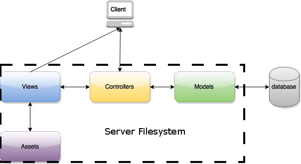
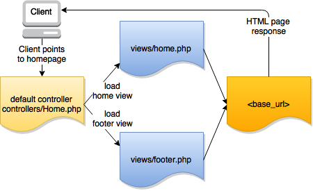
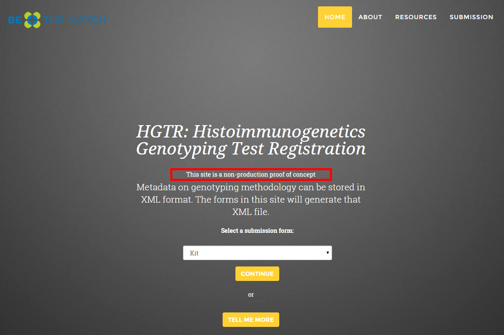
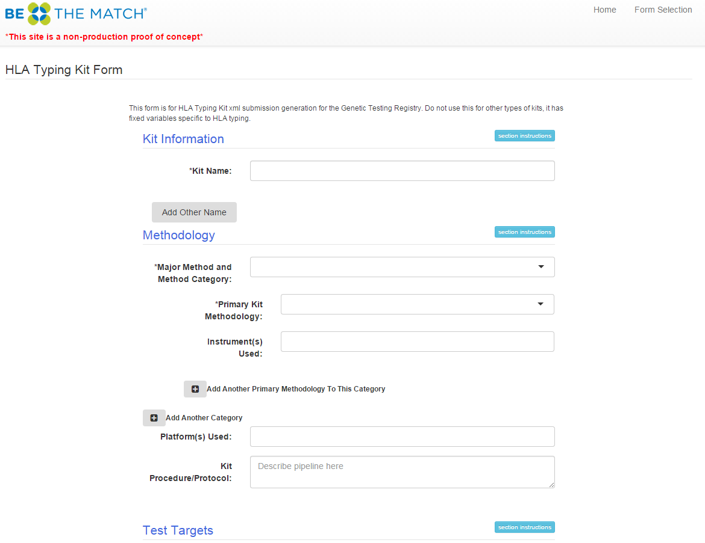
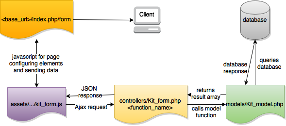
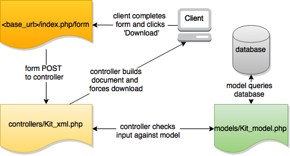

# HGTR: Histoimmunogenetics Genotyping Test Registration

<a href="http://hgtr.b12x.org" target="_blank">Visit The HGTR Site</a>

A php web application with forms for entering metadata on genotyping tests and kits for histoimmunogenetics. The forms then generate xml files similar to the standard from the [NCBI Genetic Testing Registry (GTR)](http://www.ncbi.nlm.nih.gov/gtr/).

**Table of Contents**

- [HGTR: Histoimmunogenetics Genotyping Test Registration](#hgtr-histoimmunogenetics-genotyping-test-registration)
	- [Installation](#installation)
		- [Windows](#windows)
		- [Linux](#linux)
		- [OS X](#os-x)
 	- [Structure](#structure)
		- [Filesystem](#filesystem)
		- [Database](#database)
	- [Development and Deployment](#development-and-deployment)
		- [Local Development](#local-development)
	- [Understanding the code](#understanding-the-code)
		- [MVC](#mvc)
		- [Walk-Through](#walk-through)
			- [Home Page](#home-page)
			- [Kit Form](#kit-form)
			- [XML Download](#xml-download)
		- [Additional Libraries and Packages](#additional-libraries-and-packages)
		- [External Sources](#external-sources)

## Installation

**General installation process**

- Install an AMP stack (Apache-MySQL-PHP). Options can be found in [this list](https://en.wikipedia.org/wiki/List_of_Apache–MySQL–PHP_packages).
- Copy the contents of [/HGTR](HGTR) into the 'www' or 'htdocs' (depends on your enviroment) directory
- Run [/database/gtrsqldump.sql](database/gtrsqldump.sql) on the MySQL server
- Check and update configuration settings
- Start Server

**Step-by-step Guide**

#### Windows

Tested and working on Windows 7 with

WampServer 2.5:

| PHP    | Apache | MySQL  |
|--------|--------|--------|
| 5.5.12 | 2.4.9  | 5.6.17 |


1. Install [WampServer 2.5](http://www.wampserver.com/en/)
	- The commands below assume installation to C:\ drive
2. Clone this repository or download the zip of this repository and extract
3. Copy the contents of [/HGTR](HGTR) into 'C:\wamp\www' in your WampServer installation directory
4. Setup the database using either option below
	- PHPMyAdmin
		- Start the WampServer services
		- In your browser navigate to 'localhost/phpmyadmin'
		- Click 'New' on the left pane
		- Create database. Name it 'gtr' and choose 'utf8_bin' for collation and create
		- Select the 'gtr' database on the navigation pane on the left
		- Select 'Import' on the top menubar (The page should say importing in database "gtr", make sure it says this and that you are not importing in the current server)
		- Select 'choose file' and select ['...\database\gtrsqldump.sql'](database/gtrsqldump.sql) in your copy of this repository
		- Make sure 'Format' is 'SQL' and SQL compatability mode is 'none'
		- Click 'Go' at the bottom of the page
	- MySQL command
		- Click on the WampServer icon in the Notifications Area on the bottom right of the desktop
		- Mouse over MySQL and then click on 'MySQL Console' and login (there should be no password, just hit enter)
		- Create a new database `create database gtr`
		- Import the database by running the SQL file. Provide the full path in the command below to ['...\database\gtrsqldump.sql'](database/gtrsqldump.sql) in your copy of this repository
			- Run `source gtrsqldump.sql`
5. Configure
	- Setup development folder
		- Graphical
			- Open C:\wamp\www\application\config
			- Make a new folder named 'development'
			- Copy database.php and config.php from the config directory into the new development directory
		- Command Line
			- `cd C:\wamp\www\application\config`
			- `md development`
			- `xcopy config.php development`
			- `xcopy database.php development`
	- Configure files
		- config\database.php
			- update the following fields in this file:

			> 'username' => 'root',

			> 'database' => 'gtr',

			Hostname should already be localhost and there is no password.			

		- config.php
			- update base_url. This step is not necessary if your site resides at 'localhost' but is
			helpful if you have a different base.
6. Start WampServer and open browser to 'localhost'

#### Linux

Tested and working on Linux Mint Cinnamon 17.2 Rafaela with 

XAMPP 5.5.27 (XAMPP is cross compatible with Linux, OS X, and Windows):

| PHP    | Apache    | MySQL  |
|--------|-----------|--------|
| 5.5.27 | 2.4.16    | 5.6.25 |


- Install [XAMPP](https://www.apachefriends.org/index.html)
- You may want to login to root with `su` for this session, or else you may have to re-enter commands with `sudo` if permission denied
```
# Clear htdocs, clone into it (<url> is the git url to the right on GitHub page)
# and login to MySQL Server

$ cd /opt/lampp
$ rm -rfv htdocs && mkdir htdocs
$ cd htdocs
$ git clone <url> .
$ /opt/lampp/lampp startmysql
$ /opt/lampp/bin/mysql -u root

# Build the database

mysql> create database if not exists gtr;
mysql> use gtr;
mysql> source /opt/lampp/htdocs/database/gtrsqldump.sql;
mysql> exit;

# Configure the framework

$ cd /opt/lampp/htdocs/HGTR/application/config
$ mkdir development
$ cp config.php development
$ cp database.php development
$ cd development
$ nano database.php
```
In nano, edit the file, updating the following two values as shown below

> 'username' => 'root',

> 'database' => 'gtr',

hostname should already be 'localhost' and there is no password.
The following nano commands will save and exit: `^O`, `Enter`, `^X`
```
$ nano config.php
```
In nano, edit the file, updating the base url as below

> $config['base_url'] = 'http://localhost/HGTR';

The following nano commands will save and exit: `^O`, `Enter`, `^X`

- Restart XAMPP
- Open browser to 'localhost/HGTR'

#### OS X

[to be completed later]

## Structure

##### Filesystem

[HGTR](HGTR) directory is the root directory for the web files. This implementation is being run on an AWS Elastic Beanstalk, which deploys it as a
PHP application, so it does not reveal other directories and only cares about this one root directory. On your local development, you can use an Apache server where the contents of the HGTR
directory are typically placed within the 'www' or 'htdocs' directory of a server. 

##### Database

[database](database) contains a SQL file that will construct all the tables and populate them with the data needed. A MySQL database was used and the SQL file will run cleanly when executed on a MySQL Database. 
You can name your database whatever you want, but you must edit your database.php to reflect this database name.

## Development and Deployment

More specific instructions on setting up a local development are [above](#installation). If you fork this repository, you should create a 'development' directory within the [config directory](HGTR/application/config). In here, copy [config.php](HGTR/application/config/config.php) and [database.php](HGTR/application/config/database.php) and in your local development, CodeIgniter will use the configuration settings found within this folder, while GitHub will ignore that directory when you commit (it is in the .gitignore already).

In config.php, you will set such things as the base_url. CodeIgniter will try to auto-guess this or it will load 'localhost' if it cannot guess correctly or if you are working locally.

In database.php you will configure your database connection here.

In the main 'config' directory, routes.php is where you can redefine your default controller if you wish to do so.

Do not put any login credentials or private information into the files within the main 'config' directory, as a copy on GitHub would be public. 

In the implementation of this website, the local development is configured from within the '/development' directory and the production deployment is handling the configuration on the server. This repository is directly linked to our Jenkin's server, which writes over the config files with its own, and deploys its build to Amazon. This server is also listening for commits to the base master branch. Any push to it will initiate a new build on Jenkins automatically. This means the website is automatically updated whenever the repository is updated.

## Understanding the code

This site was written in PHP on the [CodeIgniter Web Framework](http://codeigniter.com).
CodeIgniter is a PHP Framework that is loosely based on MVC (Models-Views-Controllers) or sometimes argued as PAC (Presentation-Abstraction-Control)

#### MVC

From CodeIgniter's site:

"MVC separates application logic from presentation. It permits your web page to contain minimal scripting since the presentation is separate from the PHP scripting.

The **Model** represents your data structures. Typically your model classes will contain functions that help you retrieve, insert, and update information in your database.

The **View** is the information that is being presented to a user. A View will normally be a web page, but in CodeIgniter, a view can also be a page fragment like a header or footer. It can also be an RSS page, or any other type of 'page'.

The **Controller** serves as an intermediary between the Model, the View, and any other resources needed to process the HTTP request and generate a web page."



* Models can be found [here](HGTR/application/models)
* Views can be found [here](HGTR/application/views)
* Controllers can be found [here](HGTR/application/controllers)


All of the files within the above directories are PHP, so any other languages, such as HTML or SQL, are wrapped within these php files.

Other libraries or filetypes used to help construct the views, such as javascript, css, or images, can be stored within the assets directory [here](HGTR/assets)

#### Walk-Through

Below is a walk-through of a typical use-case of the website and how the components of the framework interact.

##### Home Page




A user visits the site home page. This loads the default controller, which is [controllers/Home.php](HGTR/application/controllers/Home.php). Remember, this is defined as the default controller in 
[config/routes.php](HGTR/application/config/routes.php). You can view the controller file to see that it is loading views to produce a response to display to the client. It is loading [views/home.php](HGTR/application/views/home.php) and the [views/footer.php](HGTR/application/views/footer.php).

This results in this home page on the user display:



##### Kit Form


If the user chooses the default selection for the form, a kit, and clicks continue this will redirect the page to the kit form. The selection in the drop-down is being sent as a form POST when the user clicks 'CONTINUE'. The form submit action is to POST to a specific URI, base_url/index.php/form. This tells the server to load the controller named Form, found at [controllers/Form.php](HGTR/application/controllers/Form.php). This controller takes the data posted from the selection 
so that it can determine how to respond. If kit is selected, this loads the kit form. It does this by loading views for the [views/header.php](HGTR/application/views/header.php), the form itself found at [views/kit_form.php](HGTR/application/views/kit_form.php) and the [views/footer.php](HGTR/applications/views/footer.php).

This results in this kit form page on the user display:



There are drop-down fields in this form that are being configured by the javascript file for the page, found in [assets/js/views-js/kit_form.js](HGTR/assets/js/views-js/kit_form.js). This is using [Selectize](http://brianreavis.github.io/selectize.js/) to turn text-input fields into drop-down fields with search and 'other' input capabilities. The data is being populated by Ajax requests for the data. Within the javascript file, there are requests to specific URIs that
call controllers to respond with JSON data that the models queried from the database.



The same javascript file also has jQuery functions to respond to button clicks on the '+' symbols for repeating form sections. The function will append an HTML template, update IDs with a count, and reapply Selectize configuration and data population. The same functions will also rename some input field names to POST them as separate arrays to the controller.

##### XML Download

The form has a 'Download XML File' button as seen below. It will not process until the form has passed validation from the [jQuery Validation Plugin](http://jqueryvalidation.org/). Any restrictions such as required fields, minimum
character count, maximum entries, etc. can be enforced within the kit_form.js file as a validation rule. New functions may also be written too for any special requirements.


This button is the form submission that takes the action to POST the form data to the [controllers/Kit_xml.php](HGTR/application/controllers/Kit_xml.php). 



This controller takes all the POST data from the form, and uses it in building an
XML document. There are some calls to the [Kit_model](HGTR/application/models/Kit_model.php) to return a Gene ID from a given gene symbol, or to check if a possible input was user defined. For the latter, this will be used for any field
that allows user input. The function will check each input for that field and see if it exists in the database. This is necessary, because if it does not exist, the value is not simply placed as the element text. By the GTR schema, a user
suggestion value is placed in the attribute, and for all such inputs the element text is 'Other'.

Some values are fixed for this XML document build. This controller is where any edits or updates need to be made for such fixed values. It is also where new fields or changes to the schema need to be reflected. At the end of the document build, the XML document is saved to a string which is named and a PHP function forces a download of the XML file to the client's machine. No views are loaded, the page does not redirect, the button submit action will POST to this controller
that builds the document and downloads it in place.

#### Additional Libraries and Packages

The [jQuery](https://jquery.com/) library is loaded for the dynamic functionality of many pages.

[Bootstrap](http://getbootstrap.com/) is being used to make quick work of formatting and styling the site. The site uses the boostrap theme css, as well as the required boostrap css and js files. 

Buttons, icons, and some images are from [Font Awesome](http://fortawesome.github.io/Font-Awesome/).

The drop-down menus are being populated with data through Ajax calls that return data from the database. The drop-downs are then being constructed by [Selectize](http://brianreavis.github.io/selectize.js/).

The form will not allow a file to be downloaded until certain rules are met. This is being enforced with [jQuery Validation Plugin](http://jqueryvalidation.org/).

Repeating sections are using jQuery functions to append a templated HTML section that in some places will update the ID and Name with a count so functions can be reapplied or separate arrays can be POSTed with similar, but different,
 names.

#### External Sources

All files without LGPL headers within [/HGTR](HGTR), excluding [/HGTR/assets](HGTR/assets) are part of the original CodeIgniter Web Framework 3.0 under the MIT License.


